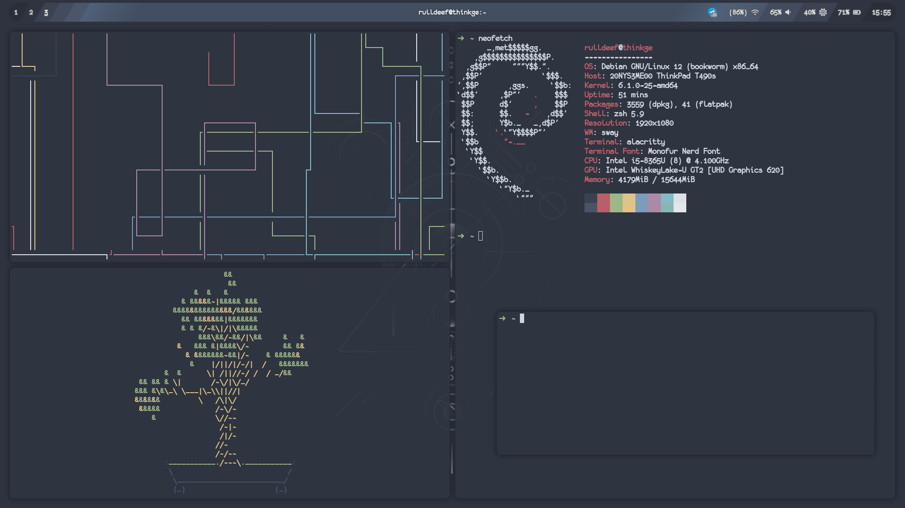
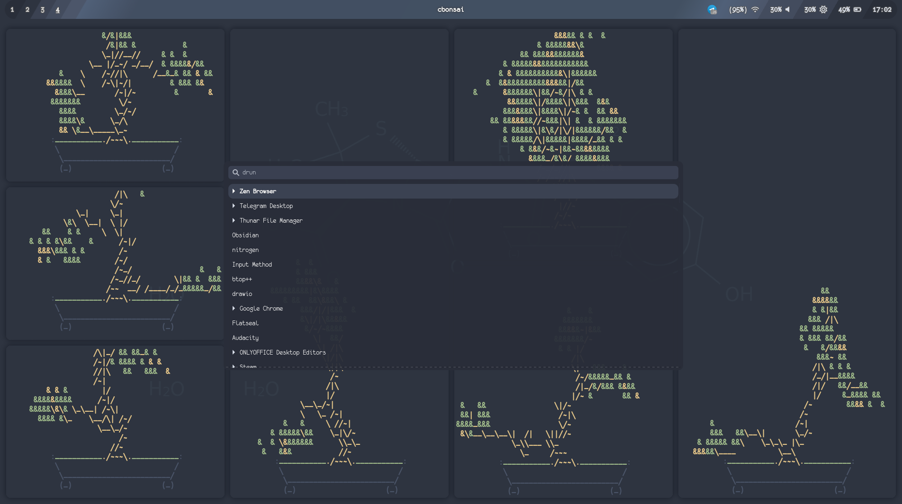

# My Dot files for sway DM

How it looks:

Dependencies:

- [swayfx](https://github.com/WillPower3309/swayfx) (sway, but with rounded corners and shadows for windows)
- [swaylock-effects](https://github.com/mortie/swaylock-effects) (for fancy lock screen)
- wofi (drun menu)
- [wofi-power-menu](https://github.com/szaffarano/wofi-power-menu) (drun menu for boot options)
- [waybar](https://github.com/Alexays/Waybar)
- [sway-screenshot](https://github.com/Gustash/sway-screenshot) (for screenshots)

